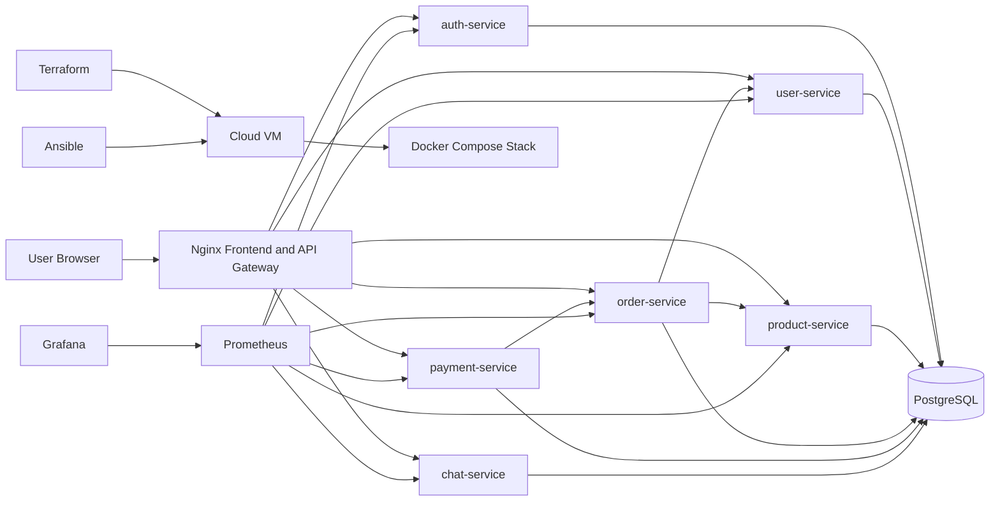

# Architecture Diagram

## Notes

- Nginx serves the frontend and routes `/api/*` requests to backend services.
- Each FastAPI service exposes `/health` and `/metrics`.
- Prometheus scrapes metrics from all backend services.
- Grafana visualizes service availability, request rate, and error trends.
- The incident simulation breaks the Order Service database hostname.
- Payment Service provides the sixth backend microservice required by the end-term project.
